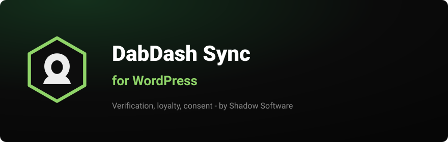

<p align="center">
  
</p>

<h1 align="center">DabDash Sync for WooCommerce</h1>

<p align="center">
  <strong>Keep WooCommerce customers in step with DabDash — verification status,
  loyalty balance, and marketing consent — with DabDash as the source of truth.</strong><br>
  Storefront-facing flags stay honest. Sensitive documents never land in
  <code>wp_usermeta</code>.
</p>

<p align="center">
  <a href="https://github.com/shadow-software/dabdash-for-woocommerce/releases/latest"></a>
  
  
  <a href="LICENSE"></a>
  <a href="https://packagist.org/packages/shadow-software/dabdash-php-sdk"></a>
  <a href="https://shadowsoftware.com/"></a>
</p>

<p align="center">
  <a href="https://github.com/shadow-software/dabdash-for-woocommerce/releases/latest">Download the latest ZIP</a>
  &nbsp;·&nbsp;
  <a href="#installation">Installation</a>
  &nbsp;·&nbsp;
  <a href="docs/SUBMISSION.md">WordPress.org submission</a>
</p>

<p align="center">
  <b>Built &amp; maintained by <a href="https://shadowsoftware.com/">Shadow Software</a></b> —
  a WordPress &amp; WooCommerce development studio. <a href="https://shadowsoftware.com/">Need a custom store? Let's talk. →</a>
</p>

---

## Why this plugin

A cannabis retailer running DabDash and a WordPress (or WooCommerce) storefront
is holding the same customer truth in two places. Verification flags, loyalty
balance, and marketing consent drift — and the first time a blocked customer
checks out, or an unsubscribed shopper gets another SMS, you learn why it matters.

DabDash Sync closes that gap. DabDash is canonical for verification and loyalty.
WordPress may propose contact and consent edits; it cannot forge ID, medical, or
email/phone verification state. Consent is a ratchet: the most-restrictive value
always wins.

- 🔐 **DabDash owns verification.** Timestamps and medical eligibility never get
  invented in WordPress.
- 🧾 **Consent is most-restrictive.** An unsubscribe on either side survives and
  is proposed upward so both platforms converge.
- 🚫 **Sensitive fields stay out.** ID images, medical record numbers, and date of
  birth are classified **never** and are not mirrored into `wp_usermeta`.
- 🔁 **Background sync.** Action Scheduler when present, otherwise WP-Cron —
  hourly pull, queued push proposals.
- 📦 **Official PHP SDK.** Runtime talks through
  [`shadow-software/dabdash-php-sdk`](https://packagist.org/packages/shadow-software/dabdash-php-sdk)
  on Packagist (shipped in `vendor/`).

## Requirements

- WordPress 6.4+, PHP 8.1+
- A DabDash tenant with an API base URL and access token
- (Optional) WooCommerce — works with WooCommerce customer accounts

## How it works

1. **Connect.** Enter your tenant API base URL and access token under
   **Settings → DabDash Sync**.
2. **Review the field map.** Diagnostics show which fields are `canonical`,
   `contact`, `consent`, or `never`.
3. **Enable sync.** An hourly job pulls customers, links them to WP users, and
   applies DabDash-owned fields. Contact/consent proposals queue upward.

## Field authority

| Kind | Examples | Who wins |
| ---- | -------- | -------- |
| **canonical** | ID / medical / email / phone verification | DabDash only |
| **contact** | name, phone, address | WordPress may propose; DabDash stores |
| **consent** | email/SMS marketing | Most-restrictive merge |
| **never** | ID images, MRN, DOB, passwords | Not mirrored |

## Architecture

```
Api/SdkFactory   → shadow-software/dabdash-php-sdk (CustomersApi, …)
Sync/FieldMap    → canonical | contact | consent | never
Sync/Resolver    → conflict rules (consent = most-restrictive)
Sync/LinkMap     → WP user ↔ DabDash customer id
Sync/Puller      → customerList apply
Sync/Pusher      → customerUpdate proposals
Sync/Queue       → Action Scheduler or WP-Cron
Admin/Settings   → connect + diagnostics
```

## Installation

**From a ZIP (recommended until WordPress.org listing is live)**

1. Download the ZIP from
   [GitHub Releases](https://github.com/shadow-software/dabdash-for-woocommerce/releases/latest).
2. In WordPress: **Plugins → Add New → Upload Plugin**, choose the ZIP, install
   and activate.
3. Go to **Settings → DabDash Sync**, enter credentials, enable sync.

**From source**

```bash
composer install --no-dev
```

The distributed ZIP already includes `vendor/` (the DabDash PHP SDK). Do not
commit `auth.json` or secrets.

## Privacy

What is synced: the customer fields in the field map after you save credentials
and enable sync — verification timestamps, loyalty/coupon eligibility, contact
fields you allow, and marketing consent.

What is **never** synced: passwords, ID document images, medical documents, date
of birth, and other `never`-classified fields.

The plugin only talks to the DabDash tenant API URL you configure. See
[`readme.txt`](readme.txt) **External services** for the WordPress.org directory
requirements.

## Development

```bash
composer install
composer lint     # WordPress Coding Standards + PHP 8.1 compatibility
composer stan     # PHPStan
composer test     # PHPUnit
composer ci       # all three
```

Runtime API client:
[`shadow-software/dabdash-php-sdk`](https://packagist.org/packages/shadow-software/dabdash-php-sdk)
(`^0.2`, Packagist).

WordPress.org submission status: [docs/SUBMISSION.md](docs/SUBMISSION.md).

## Security

Found something? Please **do not** open a public issue — see [SECURITY.md](SECURITY.md).

## About Shadow Software

<table>
<tr>
<td width="86" valign="middle">
  
</td>
<td valign="middle">

**[Shadow Software](https://shadowsoftware.com/)** is a Florida software studio
building custom WordPress, WooCommerce, and web applications since 2019. This
plugin is free and open source, and it doubles as a showcase of the kind of work
we do.

**Need a custom WooCommerce integration, a payment flow, or a plugin built
right?** → **[shadowsoftware.com](https://shadowsoftware.com/)** ·
[Get in touch](https://shadowsoftware.com/contact)

</td>
</tr>
</table>

## License

[GPL-2.0-or-later](LICENSE) © [Shadow Software LLC](https://shadowsoftware.com/).
"WordPress", "WooCommerce", and "DabDash" are trademarks of their respective
owners; this plugin is an independent, unofficial integration.

---

## Also by Shadow Software

**WordPress & WooCommerce**

| | |
|---|---|
| [**Broadside**](https://github.com/shadow-software/broadside-theme-for-wordpress) | A broadsheet block theme for WordPress — blackletter masthead, folio rule, three-column lead grid. |
| [**Broadside Blocks**](https://github.com/shadow-software/broadside-blocks-for-wordpress) | The editorial furniture that ships with it — short answer, takeaways, contents, FAQ schema, sources. |
| [**Crypto for WooCommerce**](https://github.com/shadow-software/crypto-for-woocommerce) | Free, self-custodial crypto payments — ETH, USDC, USDT & Bitcoin, confirmed on-chain. [On WordPress.org →](https://wordpress.org/plugins/shadow-software-crypto-for-woocommerce/) |
| [**AGT Sync for WooCommerce**](https://github.com/shadow-software/agt-for-woocommerce) | Sync your WooCommerce store with your American Gun Trader dealer listings. |
| [**DabDash Sync for WooCommerce**](https://github.com/shadow-software/dabdash-for-woocommerce) | Verification, loyalty, and consent — DabDash as the source of truth. |

**SDKs**

| | |
|---|---|
| [`shadow-software/agt-php-sdk`](https://github.com/shadow-software/agt-php-sdk) | PHP client for the AGT Dealer API (Packagist). |
| [`shadow-software/dabdash-php-sdk`](https://github.com/shadow-software/dabdash-php-sdk) | PHP client for the DabDash Tenant API (Packagist). |
| [`@shadow-software/agt-sdk`](https://github.com/shadow-software/agt-sdk) | TypeScript client for the AGT Dealer API (npm). |
| [`@shadow-software/dabdash-sdk`](https://github.com/shadow-software/dabdash-sdk) | TypeScript client for the DabDash Tenant API (npm). |

**n8n**

| | |
|---|---|
| [**n8n-nodes-huggingface-space**](https://github.com/shadow-software/n8n-nodes-huggingface-space) | Run inference on any Hugging Face Gradio Space from n8n. |
| [**n8n-nodes-custom-exec-node**](https://github.com/shadow-software/n8n-nodes-custom-exec-node) | Brings back `bash` in n8n, which v2.0 removed. |

<p align="center">
  <sub><a href="https://shadowsoftware.com/">shadowsoftware.com</a> · GPL-2.0-or-later · © 2026 Shadow Software LLC</sub>
</p>
